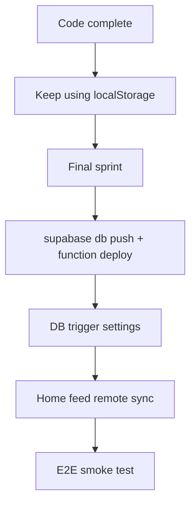

# TrueCircle Todo Checklist — Revisit

## Completed (original foundation)

All items in [`.cursor/plans/truecircle_trust_foundation_00f31777.plan.md`](.cursor/plans/truecircle_trust_foundation_00f31777.plan.md) are marked **completed**:

| Phase | Scope |
|-------|--------|
| Phase 1 | Signup profile gaps (`occupant_type`, gender, budget) wired into `ViewerProfile` |
| Phase 2 | Trust multiplier model in match engine |
| Phase 3 | Circle markers + "In Your Circle" feed ordering |
| Phase 4 | LinkedIn OAuth / social verification |
| Phase 5 | ID verification gates (publish / contact) |
| Phase 6 | Landlord preference fields + mutual matching |
| Phase 7 | Tower weight tuning + shared lifestyle fields |

---

## Completed (revisit plan — code in repo)

| # | Item | Key files |
|---|------|-----------|
| 1 | Listings DB migration SQL | `supabase/migrations/20260601120000_listings_infrastructure.sql` |
| 2 | Supabase save + localStorage fallback | `listings_supabase_service.dart`, `add_listing_screen.dart` |
| 3 | `enrich-location` + INSERT trigger SQL | `supabase/functions/enrich-location/`, `20260601120001_...sql` |
| 4 | Dublin seed infrastructure | `sample_listings_dublin.dart` (seed v5) |
| 5 | Listing detail infrastructure | `listing_detail_screen.dart` |
| 6 | Unified Irish tier tooltips | `trust_tier_tooltips.dart` |
| 7 | Auth signup commute parity | `auth_screen.dart` |

**Local demo works without deploying Supabase.** Save tries remote insert when signed in; failures fall back to localStorage silently.

---

## Final sprint (pending — deploy & production)

Defer until you move off localStorage-only demo.

### 1. Supabase deploy
```bash
supabase db push
supabase functions deploy enrich-location --no-verify-jwt
supabase secrets set GOOGLE_PLACES_API_KEY=<your-key>   # optional
```

### 2. Trigger database settings
In Supabase SQL editor (required for auto `proximity_data` on INSERT):
```sql
ALTER DATABASE postgres SET app.settings.supabase_url = 'https://<project-ref>.supabase.co';
ALTER DATABASE postgres SET app.settings.service_role_key = '<service-role-key>';
```

### 3. Home feed remote sync
Wire home screen to fetch/merge `public.listings` when authenticated (save path exists; fetch does not yet).

### 4. E2E QA
- Sign in → add listing with geolocation → confirm `proximity_data` on row (after deploy)
- Card bottom subtext + detail infrastructure section
- Profile commute match on shared listings



| Priority | Task | Status |
|----------|------|--------|
| Sprint | `supabase db push` + deploy `enrich-location` | **Pending** |
| Sprint | Postgres `app.settings` for trigger | **Pending** |
| Sprint | Home feed load from Supabase | **Pending** |
| Sprint | E2E smoke test | **Pending** |

---

## What to do now vs later

| Now (localStorage) | Final sprint |
|--------------------|--------------|
| Run app, test cards/detail/profile/signup | Deploy Supabase migrations + edge function |
| Use Dublin seed listings | Configure trigger DB settings |
| Add listings (local cache) | Remote listing fetch on home |
| Skip `supabase db push` | Full cloud persistence + auto transit enrichment |
