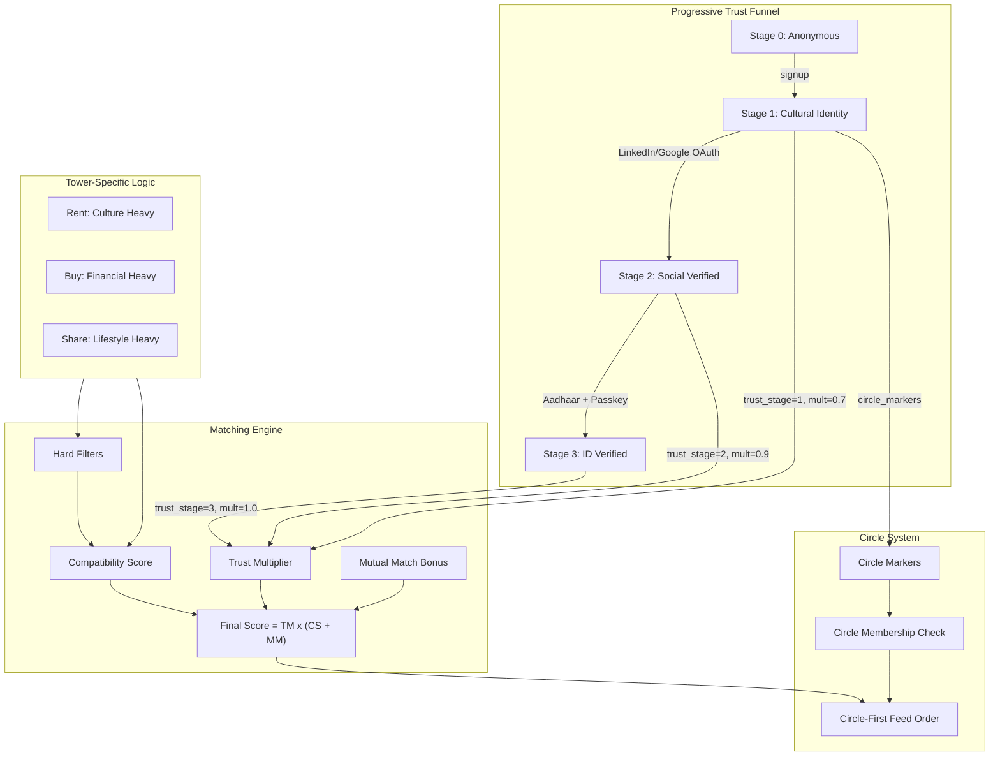

# TrueCircle Trust Foundation -- Refined Architecture

## The Core Problem with Current Implementation

Your matching engine already has the right skeleton (tower-specific weights, hard filters, soft scoring), but it has **5 critical gaps** that prevent it from being the foundation you need:

1. **Trust is invisible** -- `is_aadhaar_verified`, `identity_trust_tier`, `social_trust_score` exist in schema but have **zero impact** on ranking or UI
2. **Profile is half-empty** -- Auth signup never collects `occupant_type`, `gender_preference`, `student_type`, `company`, or `budget` -- yet the match engine expects all of them
3. **Trust is additive, not multiplicative** -- A +10 for "has company" treats trust as a bonus, not as the foundation. An unverified listing with perfect food/language match should NOT outrank a verified one with good match
4. **One-directional matching** -- Only the seeker is scored against listings. The landlord's preferences about their tenant are not factored in
5. **No "Circle" exists** -- The app is called True Circle, but there is no concept of trust circles, verified communities, or progressive access gates

---

## Refined Architecture: Trust as the Foundation Layer

### Design Principle: Trust x Compatibility, Not Trust + Compatibility

```
Final Score = TrustMultiplier x CompatibilityScore
```

This means:
- A **Stage 3 verified** listing with 60% compatibility ranks HIGHER than an **unverified** listing with 90% compatibility
- Trust is not a "nice to have" -- it is the multiplier that gates visibility

### Trust Multiplier Values

| Trust Stage | Multiplier | Meaning |
|---|---|---|
| Stage 0 (Anonymous) | 0.4x | Visible but buried. "Unverified listing" badge |
| Stage 1 (Casual) | 0.7x | Basic profile exists. Shows cultural signals |
| Stage 2 (Social) | 0.9x | LinkedIn/social verified. Professional credibility |
| Stage 3 (Cryptographic) | 1.0x | Full ID verified. Full ranking power |

A Stage 3 user with 70% compatibility = `1.0 x 70 = 70`
A Stage 0 user with 95% compatibility = `0.4 x 95 = 38`

This is the key differentiator from 99acres/MagicBricks. Their listings are flat. Yours are **trust-weighted**.

---

## Refined 3-Stage Progressive Trust Funnel

### Stage 1: Cultural Identity (Frictionless)

**When it triggers:** Signup -- required to save, search with personalization, or follow

**Data collected (refining your proposal):**
- Name (required)
- Location -- HTML5 Geolocation with manual override (you have this mocked today, wire it real)
- Food Preference -- Pure Veg / Eggetarian / Non-Veg / No Preference
- Native Place / Hometown
- Mother Tongue and Spoken Languages (multi-select)
- **NEW: Occupant Type** (Family / Bachelor / Student) -- currently missing from signup
- **NEW: Gender** (for bachelor/shared matching) -- currently missing from signup
- **NEW: Budget Range** (optional slider) -- currently missing from signup

**Why add occupant/gender/budget to Stage 1:** Your match engine already expects these fields but auth never collects them. Without them, the "hard filters" for Rent and Share towers never fire for logged-in users. This is the single biggest gap between your engine and your signup flow.

**Trust tier:** `Casual_Browser` -> multiplier 0.7x

**Privacy:** All Stage 1 data is visible on profile cards.

### Stage 2: Social Reputation (Optional, Incentivized)

**When it triggers:** User wants "Verified Professional" badge, higher ranking, or access to premium community features

**Data collected (refining your proposal):**
- LinkedIn OAuth -- pull company, title, career duration
- Google/Facebook OAuth -- establish digital identity age (account must be >6 months old to count)

**Refinement from your proposal:**
- Do NOT use Facebook Graph API for "long-standing identity" -- Meta's API restrictions make this unreliable. Instead, use **Google OAuth** (virtually everyone has one, account age is derivable from profile creation date)
- LinkedIn is the power signal for India's rental market. A "Software Engineer at Microsoft" badge on a listing card is worth more than any other trust signal
- **Anti-gaming:** Require LinkedIn account to have >50 connections or >1 year history. Freshly created LinkedIn accounts get no trust boost

**Trust tier:** `Social_Verified` -> multiplier 0.9x

**Privacy:** Shows badge + company/title. Never shows connection count or profile URL.

### Stage 3: Cryptographic Identity (Required for Publishing/Transacting)

**When it triggers (refining your proposal):**
1. "Publish Listing" -- you must verify to post
2. "Contact Host" -- you must verify to initiate contact (this is the KEY gate you're missing)
3. "Initiate Transaction" -- deposit, agreement, booking

**Why gate "Contact Host" behind Stage 3:** This is the insight 99acres misses. On 99acres, any anonymous person can spam a landlord. On TrueCircle, the landlord knows that anyone who contacts them has verified their identity. This creates **mutual trust** -- the foundation of your "circle".

**Data collected:**
- Aadhaar offline QR scan (you have the UI built in `verification_screen.dart`, needs real UIDAI XML parsing)
- Device biometrics / Passkey (you have `biometric_service.dart`, needs wiring)
- Optional: PAN card for Buy/Sell transactions

**Trust tier:** `ID_Verified` -> multiplier 1.0x

**Privacy:** Shows "ID Verified" shield badge. Never shows Aadhaar number, name from Aadhaar, or any PII.

---

## Refined Tower-Specific Scoring

Your existing weights are solid. Here is what I would refine:

### RENT Tower (Max Compatibility: 200)

**Hard Filters (unchanged, but now actually enforced since signup collects the data):**
- Occupant type mismatch -> reject
- Gender mismatch -> reject
- Student backing mismatch -> reject

**Weighted Scoring (refined):**

| Factor | Current | Proposed | Rationale |
|---|---|---|---|
| Food match | 40 (60 boosted) | 40 (60 boosted) | Keep -- correctly weighted |
| Language match | 35 | 35 | Keep -- critical for Indian rental |
| City/Location | 35 (50 boosted) | 30 (45 boosted) | Slightly reduce -- location is a filter, not a compatibility signal |
| Occupant match | 30 (45 boosted) | 30 (45 boosted) | Keep |
| Gender match | 20 (35 boosted) | 20 (35 boosted) | Keep |
| Nativity match | 20 | 25 | Increase -- "same hometown" is a powerful trust signal in India |
| Student backing | 15 | 15 | Keep |
| Company/Job | 10 | **0** | REMOVE from compatibility. Move to Trust Multiplier (Stage 2) |
| Profile completeness | 10 | **0** | REMOVE. Trust Stage already captures this |
| Price fit | 10 | 10 | Keep |
| **NEW: Mutual match** | -- | **15** | Landlord's stated preference matches seeker's profile |

**Key change:** Company and profile completeness are no longer additive compatibility points. They are captured by the Trust Multiplier. This prevents double-counting.

**Final Rent Score = Trust Multiplier x Compatibility Score (out of 200)**

### BUY/SELL Tower (Max Compatibility: 150)

**Hard Filters:**
- Budget mismatch -> reject
- Property type mismatch -> reject

**Weighted Scoring (refined):**

| Factor | Current | Proposed | Rationale |
|---|---|---|---|
| Price alignment | 40 | 45 | Increase -- this IS the core signal for Buy |
| Budget compatible | 30 | 30 | Keep |
| City/Region | 35 (50 boosted) | 25 (40 boosted) | Reduce -- Buy is less location-emotional |
| Company/Job | 20 | **0** | Move to Trust Multiplier |
| Profile completeness | 15 | **0** | Move to Trust Stage |
| Property type | 10 | 15 | Increase -- more important than currently weighted |
| Language | 5 | 10 | Slight increase -- trust matters even in transactions |
| Nativity | 5 | 5 | Keep low |
| Food | 40 (60 boosted) | 10 | Drastically reduce -- food preference is almost irrelevant for buying |
| **NEW: Mutual interest** | -- | **10** | Seller's preferred buyer type matches |

### SHARED Tower (Max Compatibility: 220)

**Hard Filters:**
- Gender mismatch -> reject
- Lifestyle conflict (veg seeker + non-veg house) -> reject
- **NEW: Smoking/drinking conflict** -> reject (add lifestyle flags)

**Weighted Scoring (refined):**

| Factor | Current | Proposed | Rationale |
|---|---|---|---|
| Food match | 40 (60 boosted) | 45 (65 boosted) | Increase -- daily cohabitation makes this critical |
| Lifestyle compatible | 35 | 40 | Increase -- this is THE differentiator for shared spaces |
| Language match | 30 | 30 | Keep |
| Gender match | 20 (35 boosted) | 25 (40 boosted) | Increase -- more critical in shared than rent |
| Roommate type | 30 (45 boosted) | 30 (45 boosted) | Keep |
| Nativity match | 20 | 25 | Increase -- "same community" matters more when sharing |
| Company/Job | 15 | **0** | Move to Trust Multiplier |
| Profile completeness | 10 | **0** | Move to Trust Stage |
| Price fit | 10 | 10 | Keep |
| City | 35 (50 boosted) | 25 (40 boosted) | Reduce -- shared space seekers often relocate |
| **NEW: Schedule compatibility** | -- | **10** | Working hours, quiet hours, early riser |

---

## The "Circle" Concept -- What It Actually Means

The app is called **True Circle** but has no circle feature. Here is how to define it:

**A Circle = Your verified trust community**

```
Your Circle includes:
1. People at YOUR trust stage or higher
2. Who share at least ONE cultural marker with you (language, food, nativity)
3. Who have interacted on the platform (viewed, saved, contacted)
```

**How Circles manifest in the product:**

- **"In Your Circle" badge** on listing cards -- means the host shares your language/food/nativity AND is at your trust level or higher
- **Circle count** on your profile -- "47 people in your circle" (community size)
- **Circle-first feed** -- Home screen defaults to showing Circle listings first, then expands outward
- **Circle referrals** -- "Rajesh from your circle also viewed this listing"

This is NOT a social network feature. It is a **passive trust signal** derived from shared identity and verification level. Users never "add" people to their circle. The system computes it.

### Feed Ordering (combining Trust + Compatibility + Circle)

```
1. Circle listings, sorted by Compatibility Score (Trust already >= yours)
2. Non-circle verified listings (Stage 2-3), sorted by Trust x Compatibility
3. Unverified listings (Stage 0-1), sorted by Compatibility only, with "Unverified" badge
```

---

## Data Model Changes Required

### User Profile (add to `ViewerProfile` and auth signup):

```
NEW FIELDS:
- occupant_type: String          // Family, Bachelor, Student
- gender: String                 // Male, Female, Other
- student_type: String           // Self-funded, Loan, Family
- company: String                // From LinkedIn OAuth or manual
- job_title: String              // From LinkedIn OAuth
- budget_min: int?
- budget_max: int?
- trust_stage: int               // 0, 1, 2, 3
- trust_multiplier: double       // 0.4, 0.7, 0.9, 1.0
- linkedin_verified: bool
- linkedin_company: String
- linkedin_title: String
- social_account_age_months: int
- aadhaar_verified: bool
- passkey_bound: bool
- circle_markers: List<String>   // Computed: ['telugu', 'veg', 'hyderabad']
```

### Listing Data (add to listing schema):

```
NEW FIELDS:
- host_trust_stage: int          // 0, 1, 2, 3
- host_trust_multiplier: double
- host_circle_markers: List<String>
- host_linkedin_badge: String?   // "Software Engineer at Microsoft"
- host_verified_badge: bool      // Stage 3 shield
- preferred_tenant_occupant: String?  // For mutual matching
- preferred_tenant_food: String?
- smoking_allowed: bool
- drinking_allowed: bool
- quiet_hours: bool
- schedule_type: String?         // 'Day shift', 'Night shift', 'Flexible'
```

---

## Architecture Diagram



---

## What is NOT Changing

- UI layout, cards, grid, search bar, suggestion dropdown -- all stay as-is
- Search intent parsing, suggestion generation, pipeline flow -- all stay
- GoRouter routes, auth screen layout, listing detail screen -- all stay
- Local-first storage architecture -- stays until Supabase is wired separately

---

## Implementation Phases

### Phase 1: Close the Profile Gap (Foundation)
Add missing fields to signup (occupant_type, gender, budget). Wire them through ViewerProfile so hard filters actually fire. This alone will make the existing matching engine dramatically more accurate.

### Phase 2: Trust Stage Model
Implement the trust_stage/trust_multiplier on user profiles and listing hosts. Change the match engine from additive to multiplicative. Remove company/profile-completeness from compatibility scoring.

### Phase 3: Circle Computation
Derive circle_markers from profiles. Add "In Your Circle" badge to listing cards. Implement circle-first feed ordering.

### Phase 4: Stage 2 -- Social Verification
Wire LinkedIn OAuth. Pull company/title. Update trust_stage on verification. Show badge on listing cards.

### Phase 5: Stage 3 -- Cryptographic Verification
Wire real Aadhaar QR parsing (replace placeholder). Wire passkey/biometrics. Gate "Publish Listing" and "Contact Host" behind Stage 3.

### Phase 6: Mutual Matching
Add landlord preference fields to listings. Score mutual compatibility. Add mutual match bonus to ranking.

### Phase 7: Tower Weight Refinement
Apply the refined weights per tower. Tune based on real usage data. Add lifestyle/schedule fields for Shared tower.
