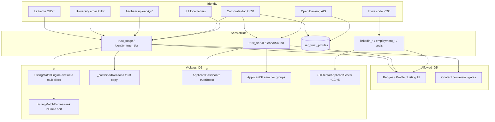

# TRUECIRCLE PHASE 7 — Trust Implementation & Verification Audit

**Repo:** `C:\Users\keepm\Desktop\Project Realme\True_circle`  
**Date:** 2026-08-07  
**Scope:** Read-only audit of trust signals, badges, workflows, ranking/matching influence, and badge truthfulness.  
**Prior leads verified in code:** `trust_signal_audit.md`, `trust_ranking_influence.md`, `implementation_file_inventory.md`  
**Locked decision D5:** Trust must NOT influence Ranking, Matching, or Match Explanations. Trust may remain visible (badges, profile UI, listing UI, conversion/contact gates).  
**Production code modified:** **No.**  
**Location/proximity frozen files modified:** **No.**

---

## Executive verdict

**Go / No-Go: NO-GO** relative to D5 + launch readiness.

Material D5 violations remain active in seeker feed ranking, match explanations, and landlord applicant ranking/grouping. Display/mock gaps alone would be GO WITH CONDITIONS; ranking/explanation influence is not.

| Metric | Count |
| --- | --- |
| Trust inventory items | **38** |
| Badge truthfulness GREEN | **3** |
| Badge truthfulness AMBER | **8** |
| Badge truthfulness RED | **7** |
| Material D5 violation sites | **8** (file:function) |

Companion JSON: [`phase7_trust_implementation_verification_audit.json`](./phase7_trust_implementation_verification_audit.json)

---

# 1. Trust Register

Per-item inventory. Status values: **exists / active / partial / demo-mock / dormant**.

| # | Name | Audience | Purpose | Current Status | Source of Trust | Display Location | Validation Method | Data Stored | Expiry Rules | Revocation Rules |
| --- | --- | --- | --- | --- | --- | --- | --- | --- | --- | --- |
| 1 | `TrustStage` (0–3 Anonymous→ID) | Seeker + Host | Progressive funnel stage + **score multiplier** | **Active** (ranking+UI) | Session `trust_stage` / `identity_trust_tier` | Profile trust section, home banner, host stamp on listings | Stage upgrades via LinkedIn / uni OTP / Aadhaar / corporate / OB / JIT letters | Session + listing `host_trust_stage` | None | None (session overwrite only) |
| 2 | `trust_tier` Just Landed / Grand / Sound | Seeker (landlord view) | Irish badge labels; **applicant sort/group** | **Active** | `user_trust_profiles.trust_tier` + session | TrustBadge, landlord streams/dashboard, passport | Mapped from stage or set by corporate/OB upgrades | DB + session | None | None |
| 3 | `identity_trust_tier` | Seeker | Alternate stage label (`Casual_Browser`, `Social_Verified`, …) | **Active** (feeds stage) | Session string | Indirect via stage | Set by TrustService upgrades | Session | None | None |
| 4 | LinkedIn social verify | Seeker / Host | Stage 2 social proof | **Partial** (real OAuth web; mock in debug) | LinkedIn OIDC `userinfo` + **self-entered** company/title | Social verify screen, contact gates, host LinkedIn badge | Edge `linkedin-oauth`; mock if `LINKEDIN_MOCK` / empty client id | Session: `linkedin_*`, stage 2 | None | None |
| 5 | University email OTP (Track A) | Student seekers | Light-trust Stage 3 via college email ownership | **Active** (real edge + Resend; `UNI_OTP_MOCK`) | OTP to allowlisted `.ac.ie`/hosts | Uni verify screen, contact gate, passport “University Acceptance” | Edge `university-email-otp`; hashed OTP in `university_email_otps` | Masked email in session; OTP row deleted on success | OTP TTL **10 min**; max 5 verifies; rate limits | OTP row deleted; **no** trust revalidation |
| 6 | Invite code + onboarding letter (Track B) | Pre-arrival students | Contact-ready Stage 2 path | **Demo-mock / POC** | Local SharedPreferences invite store + local letter path | Pre-arrival contact screen, profile invite section | `InviteCodeService` local; letter = path set, not server OCR | Session flags + local paths; demo code `DUBLIN-DEMO` | Codes: max **5** redemptions; no time expiry | Local store only; no remote revoke |
| 7 | Corporate document verify | Working professionals | Grand tier + employment_verified | **Active** (edge OCR heuristics; mock mode) | Uploaded PDF/image text extract | Corporate upload card, landlord credentials panel | Name match + 2026 year + whitelisted employer entity; seal AES-GCM | `user_trust_profiles` + session seals | None (year gate at verify time only) | None |
| 8 | Open Banking AIS | Professionals / liquidity | Grand + financial_verified | **Partial** (edge + mock) | Bank AIS snapshot / mock | OB verify screens, passport budget tier | Liquidity validator + edge `open-banking-verify` | Seals + flags; no IBAN/tokens | None | None |
| 9 | JIT employment letter | Professionals | Quick Grand / social stage | **Partial** (local path flag) | Local file path | JIT bottom sheet / profile | Path presence only (client) | Session `employment_letter_*` | None | None |
| 10 | JIT family budget proof | Arriving families | Social stage + family proof flag | **Partial** (local path) | Local scan/upload path | Family JIT flows | Path presence only | Session `family_budget_proof_*` | None | None |
| 11 | Aadhaar + Passkey (India ID) | India market seekers | Stage 3 ID Verified | **Partial / market-gated** | Aadhaar QR/upload parse + passkey bind | `verification_screen.dart` | Client parse + `upgradeIdVerified` | Session `is_aadhaar_verified`, `passkey_public_key` | None | None |
| 12 | Dublin light trust Stage 3 via uni email | Dublin students | Maps to Sound/ID stage without gov ID | **Active** | Same as #5 | Profile badges as Sound | OTP only → `upgradeLightTrust` sets stage 3 | Session | None | None |
| 13 | Host trust stamp | Landlords / listings | Publish-time host stage + badges | **Active** | `TrustService.stampListingTrust` | Listing cards/detail, match host stage | Copies current session stage/markers | Listing fields `host_trust_*`, badges, markers | None | None |
| 14 | Host LinkedIn / verified / pre-arrival badges | Listing viewers | Host trust display + circle fallback | **Partial** | Stamped from host session | Listing UI | Session flags at publish | Listing map fields | None | None |
| 15 | In Your Circle (`inCircle`) | Seekers | Relational “circle” badge + **rank priority** | **Active** | Shared language/food/city markers + host≥seeker trust + match≥75% | Card overlay, match banner/reasons | Derived in `ViewerProfile.isInCircle` + `qualifiesForInCircle` | Ephemeral on match result | None | None |
| 16 | Circle markers | Seeker↔Host | Network affinity for circle | **Active** | Mother tongue + veg/non-veg + city | Indirect | Self-declared profile/listing fields | Session + `host_circle_markers` | None | None |
| 17 | Pre-arrival docs flag | Pre-arrival seekers | Seeker mult upgrade + explanation | **Active** (ranking) | Session letter/doc flags | Match reasons, multipliers | Boolean OR of letter flags | Session | None | None |
| 18 | Pre-arrival seeker student-track mult | Pre-arrival students | ×0.9 / hard exclude on-campus | **Active** (matching+ranking) | `pre_arrival_contact_ready` ∧ empty uni email | Feed order / exclude | Listing `tenantTrackPreference` | Derived | None | None |
| 19 | Contact / conversion gates | Seekers | Gate messaging before contact | **Active** (UI/conversion; allowed under D5) | `TrustService.canContact` by cohort | Listing detail contact | Stage + Track B readiness | Session | None | None |
| 20 | Profile trust section + “listing boost” copy | Signed-in users | Show stage + **advertises multiplier** | **Active** | TrustService | `profile_trust_section.dart` | Session stage | Session | None | None |
| 21 | Home trust tier banner | Seekers | Surface current badge | **Active** | ViewerProfile stage | Home explore | Display | — | None | None |
| 22 | TrustBadge / TrustTierBadge | All | Just Landed / Grand / Sound pills | **Active** | Stage↔tier mapping | Profile, cards, landlord UI | Display mapping | — | None | None |
| 23 | Trust badge tooltips (requirements list) | All | Explain badge requirements | **Active but inaccurate** | Hardcoded strings | `TrustBadge.tooltipFor` | **Not enforced** | — | None | None |
| 24 | TrustTierTooltips (marketing copy) | All | Softer Irish gloss | **Active** | Hardcoded | Profile / cards | Marketing | — | None | None |
| 25 | Enterprise Verified badge | Working pro seekers | Polymorphic enterprise signal | **Partial / weak** | LinkedIn OR employment letter OR **non-empty company** | Polymorphic identity UI | Soft OR | Session | None | None |
| 26 | Verified Professional Host badge | Listing viewers | Host ≥ social stage | **Active** | `host_trust_stage ≥ 2` | Listing cards | Stage int | Listing | None | None |
| 27 | Tenant verification credentials panel | Landlords | GDPR-safe verification summary | **Active** | Trust tier + track flags | Landlord applicant UI | Session/trust profile | Denylists sensitive fields | None | None |
| 28 | Contextual passport verification rows | Seekers | Show verified checklist rows | **Active / partial** | Session seals & flags | Onboarding passport card | Display of flags | Session | None | None |
| 29 | Applicant dashboard trust boost | Landlords | **Rank applicants** by tier | **Active — D5 violation** | `trust_tier` sortPriority×5 | Landlord dashboard queue | Payload builder | Trust profiles | None | None |
| 30 | Applicant stream tier grouping | Landlords | Group Sound→Grand→Just Landed | **Active — D5 violation** | Same | Stream views | Payload builder | Trust profiles | None | None |
| 31 | `has_verified_grand_badge` | Landlord IP scorer | +10 applicant score | **Active — D5 violation** | Mapped from Grand/employment | Scorer only | Session sync | Co-applicant maps | None | None |
| 32 | `has_verified_corporate_email` | Landlord IP scorer | +5 applicant score | **Active — D5 violation** | `employment_verified` | Scorer only | Session sync | Co-applicant maps | None | None |
| 33 | Match explanation trust reasons | Seekers | “In your circle”, ID/Social, Grand weighting | **Active — D5 violation** | Match engine `_combinedReasons` | Cards / banners | Derived | Match result | None | None |
| 34 | `user_trust_profiles` table | Backend | Authoritative tier for landlord UI | **Active** | Corporate/OB upserts; seeds | Landlord fetch | Server upsert | DB columns | None | No revoke API |
| 35 | `university_email_otps` table | Backend | OTP store | **Active** | Edge function | Infra only | Hashed OTP | Ephemeral rows | 10 min | Delete on success/fail |
| 36 | Demo / seed trust profiles | Dev / demos | Sound/Grand/Just Landed fixtures | **Demo-mock** | SQL + Dart seeders | Landlord demos | Seeded | Seed data | N/A | N/A |
| 37 | Completeness % | Seekers | Profile fill indicator | **Active UI**; excluded from match score | Profile keys | Completeness widgets | Heuristic | Session | None | None |
| 38 | Phone verification | — | — | **Not found** | — | — | — | — | — | — |

---

# 2. Trust Dependency Map

**Allowed under D5:** badges, profile/listing display, contact gates.  
**Forbidden under D5 (still wired):** score multipliers, circle sort priority, trust-weighted match %, trust reasons in match explanations, landlord trustBoost / tier grouping / badge point adds.

**Profile UI explicitly markets violation:** `ProfileTrustSection` shows ``${stage.multiplier}× listing boost``.

---

# 3. Trust Verification Matrix

## 3.1 Trust lever analysis

| Lever class | Implemented? | Visible? | Used? | Active / dormant |
| --- | --- | --- | --- | --- |
| **Identity** — LinkedIn OIDC | Yes (web + mock) | Yes | Stage 2 upgrade; contact gates; host badge | Active (company/title self-asserted) |
| **Identity** — University email OTP | Yes | Yes | Stage 3 light trust; contact | Active |
| **Identity** — Aadhaar/Passkey | Yes (India screen) | India path | Stage 3 India | Partial / not Dublin primary |
| **Identity** — Corporate doc OCR | Yes | Yes | Grand + employment_verified | Active (heuristic) |
| **Identity** — Open Banking | Yes | Yes | Grand + financial_verified | Partial (mock common in dev) |
| **Community** — In Your Circle | Yes | Yes | **Ranking + explanations** | Active — D5 violation |
| **Community** — Invite codes | Local POC | Profile (Stage 3) | Track B contact | Demo-mock |
| **Community** — References / reputation scores | **No** | Tooltips claim them | No | Dormant / marketing fiction |
| **Behavioural** — Completeness % | Yes | Yes | UI only (excluded from match score) | Active display |
| **Behavioural** — Contact readiness gates | Yes | Yes | Conversion | Active (D5-OK) |
| **Behavioural** — TrustStage multipliers | Yes | “listing boost” copy | **Ranking** | Active — D5 violation |

## 3.2 User segment trust review

| Segment | Primary path today | Strength | Gaps |
| --- | --- | --- | --- |
| **Students** | Track A uni OTP → Stage 3 Sound; Track B invite+letter → contact-only | Email ownership **moderate**; badge maps to Sound/ID without gov ID | Overstates “ID Verified”; Track B letter not server-validated; invite store local |
| **Working Professionals** | LinkedIn → Stage 2; corporate doc / OB / JIT letter → Grand | LinkedIn identity **moderate**; employment OCR **weak–moderate**; company field alone can unlock Enterprise badge | Employer title self-declared; JIT letter path-only; Enterprise badge bypass |
| **Relocating Professionals** | Same as WP + pre-arrival docs flags | Same | Pre-arrival flags inflate seeker multiplier / explanations (D5) |
| **Families** | JIT family budget proof → social stage; OB optional | Weak (local path) | No strong identity; cohort gate needs social |
| **Hosts / Landlords** | Stage stamped onto listings; see applicant tiers | Host stage drives seeker feed rank (D5); landlord UI groups by trust | Can self-elevate via same verification paths; badge tooltips overclaim Sound |

## 3.3 LinkedIn audit

| Question | Finding |
| --- | --- |
| OAuth vs “verified”? | Real OAuth (web) exchanges code via `supabase/functions/linkedin-oauth` → LinkedIn `userinfo` (`sub`, `name`, `email`, `picture`, `email_verified`). **Not** employment verification. |
| API data used | OIDC profile only — **no** Positions API. Company & job title are **manual text fields** on `SocialVerificationScreen` after OAuth. |
| DB fields | **Not** on `user_trust_profiles`. Session-only: `linkedin_verified`, `linkedin_sub/email/name/picture`, `linkedin_company`, `linkedin_title`, plus stage/identity tier. |
| Badge event | `TrustService.upgradeSocial` → stage 2 / Grand mapping / `linkedin_verified=true`. |
| Mock | `LINKEDIN_MOCK` or debug without client id → fake profile; still upgrades trust. |
| Wording accuracy | **AMBER** — “LinkedIn connected / Socially verified” OK; implying employer/role verified is **false**. Grand tooltip claiming LinkedIn+paperwork checked is overstated for LinkedIn-only. |

**One-liner strength:** LinkedIn proves account ownership (OIDC), not job/employer authenticity.

## 3.4 University audit

| Question | Finding |
| --- | --- |
| Email ownership | Yes — 6-digit OTP emailed via Resend; hashed store; TTL 10m; attempt/rate limits. |
| Domain allowlist | Client `IrishUniversityDomains` + edge `domains.ts` (`.ac.ie` + known hosts). |
| Revalidation | **None** after success; OTP row deleted; session keeps masked email + stage 3 indefinitely. |
| Server trust profile write | Edge returns `verified: true` only; **client** `upgradeLightTrust` sets session — **does not** upsert `user_trust_profiles`. |
| Badge accuracy | Ownership proof **GREEN**; mapping to **Sound / ID Verified** **RED** (no government ID). Passport “University Acceptance Verified” overclaims acceptance vs email ownership. |

**One-liner strength:** Strong proof of mailbox control on allowlisted domains; weak as government/student-status identity; no revalidation.

## 3.5 Employer audit

| Question | Finding |
| --- | --- |
| Evidence | PDF/image upload → text extract → name tokens + active 2026 year patterns + whitelisted employer entity strings. |
| Workflow | Client streams base64 to `corporate-document-verify`; bytes purged; seal stored; `user_trust_profiles` upsert Grand/stage 2. |
| Mock | `CORPORATE_VERIFY_MOCK` fabricates matching offer letter text. |
| Alternate paths | JIT employment letter = **local path flag only** (bypass-grade). Open Banking = liquidity+identity AIS path (separate). |
| Revalidation | **None**; no employer webhook or periodic check. |

**One-liner strength:** Heuristic document OCR with entity whitelist — better than honor system, forgeable, no ongoing revalidation; JIT letter path is mock-grade.

## 3.6 Community trust audit

| Signal | Exists | Active | Visible | Ranking | Matching | Explanations |
| --- | --- | --- | --- | --- | --- | --- |
| In Your Circle | Yes | Yes | Yes | **Yes (sort key)** | Soft (network check) | **Yes** |
| Circle markers (lang/food/city) | Yes | Yes | Indirect | Via circle | Via circle | Via circle |
| Invite codes | Yes (local) | POC | Profile | No | Contact path | No |
| Reputation score | No | — | Claimed in Sound tooltip | No | No | No |
| Community references / vouches | No | — | Claimed in Sound tooltip | No | No | No |
| Trust levels JL/Grand/Sound | Yes | Yes | Yes | Landlord yes; seeker via stage | No hard exclude by tier label | Indirect via stage reasons |

---

# 4. D5 Compliance Report

**D5 rule:** Trust must not influence Ranking, Matching, or Match Explanations.

## 4.1 Material violations (still true)

| ID | Location | What happens | Surfaces |
| --- | --- | --- | --- |
| D5-1 | `lib/utils/listing_match_engine.dart` → `evaluate` | `combinedTrustMult = avg(hostTrust.multiplier, seekerMult)`; scales compatibility → score/% | Seeker browse / Active Mode Explore |
| D5-2 | `lib/theme/trust_tier_design.dart` → `effectiveSeekerTrustMultiplier` | Casual + pre-arrival docs → **0.9** instead of 0.7 | Seeker feed |
| D5-3 | `lib/utils/listing_match_engine.dart` → `_preArrivalScoreMultiplier` | Pre-arrival seeker × **0.9** on `allStudents` listings | Seeker feed |
| D5-4 | `lib/utils/listing_match_engine.dart` → hard exclude path + `isPreArrivalSeeker` / onCampusOnly | Pre-arrival excluded from on-campus-only (**matching**) | Seeker feed |
| D5-5 | `lib/utils/listing_match_engine.dart` → `rank` | Sort: **`inCircle` before** quality tier / score | Seeker feed |
| D5-6 | `lib/utils/listing_match_engine.dart` → `_combinedReasons` | Emits In your circle / Grand trust weighting / ID Verified / Socially verified | Match explanations (cards/banners) |
| D5-7 | `lib/services/applicant_dashboard_payload_builder.dart` → `_dashboardSortScore` | `trustBoost = sortPriority * 5` in composite; tier tie-break | Landlord applicant ranking |
| D5-8 | `lib/services/applicant_stream_payload_builder.dart` → stream build | Groups applicants Sound → Grand → Just Landed before score | Landlord streams |
| D5-9 | `lib/utils/full_rental_applicant_scorer.dart` → `scoreApplicantGroup` | `has_verified_grand_badge` **+10**; `has_verified_corporate_email` **+5** | Landlord IP applicant score |
| D5-10 | `lib/widgets/profile_trust_section.dart` | UI copy ``× listing boost`` documents ranking influence | Profile (symptom of D5-1) |

**Top D5 violations (file:function) for parent handoff:**

1. `listing_match_engine.dart:evaluate` — TrustStage multipliers  
2. `listing_match_engine.dart:rank` — inCircle primary sort  
3. `listing_match_engine.dart:_combinedReasons` — trust explanation strings  
4. `applicant_dashboard_payload_builder.dart:_dashboardSortScore` — trustBoost  
5. `full_rental_applicant_scorer.dart:scoreApplicantGroup` — badge +10/+5  

## 4.2 Matching note

Independent Places / Shared Living preference explanation APIs (`independentPlacePreferenceExplanations`, `sharedLivingPreferenceExplanations`) do **not** emit trust reasons (D5-OK for detail “why this works”). Card/banner path via `_combinedReasons` **does** (violation).

`WeightedListingMatcher` / marketplace pipeline body: no direct trust reads; trust enters only through `ListingMatchEngine`.

## 4.3 Allowed / non-violating uses

- Badges and tier pills on profile, home, listing overlay  
- Contact gates (`TrustService.canContact`)  
- Landlord **display** of tiers/credentials (if sort/group/score removed)  
- OTP / OAuth / corporate infra themselves  

## 4.4 Manipulability / bypass highlights

| Vector | Severity |
| --- | --- |
| Self-declared LinkedIn company/title after OAuth | High for “employer verified” claims |
| `UNI_OTP_MOCK` / `LINKEDIN_MOCK` / `CORPORATE_VERIFY_MOCK` | Dev bypass → production if flags left on |
| Invite `DUBLIN-DEMO` + local SharedPreferences | Anyone can redeem demo path locally |
| Onboarding/JIT letters = path flags | No server document proof |
| Enterprise badge if `company` non-empty + social stage | Trivial self-assert |
| Circle markers self-declared | Easy to share markers → circle sort boost |
| Client-only uni trust upgrade (no `user_trust_profiles` write) | Session spoof / desync vs landlord DB view |
| Trust tooltips claim gov API / income / references not implemented | User deception / compliance risk |

---

# 5. Badge Truthfulness Report

| Badge / claim | Rating | Rationale |
| --- | --- | --- |
| Just Landed (default casual) | **AMBER** | Accurately “new/casual”; tooltip requirements (arrival intent, funding token) **not enforced** |
| Grand (social / corporate / OB) | **AMBER** | Some real checks possible (OIDC / OCR / AIS); tooltips overclaim “identity + paperwork successfully checked” for LinkedIn-only |
| Sound (stage 3 / uni light trust) | **RED** | Tooltip: Gov API match, income >3.5× rent, community references — **none implemented**; uni OTP alone maps here |
| LinkedIn / Socially verified | **AMBER** | OAuth account real; employer/role not verified |
| University / “Acceptance Verified” | **AMBER** | Email ownership real; acceptance/enrollment not proven; Sound mapping wrong |
| Corporate / Employment verified | **AMBER** | Heuristic OCR + entity list; forgeable; JIT path RED |
| Open Banking / financial verified | **AMBER** | Real edge path exists; mock-heavy; seals not raw money (good) |
| ID Verified (Aadhaar path) | **AMBER** | India upload/QR path exists; quality depends on parse rigor; not Dublin primary |
| In Your Circle | **AMBER** | Honest as affinity marker; **not** community vouch; still used for ranking |
| Enterprise Verified | **RED** | Can fire on non-empty `company` without LinkedIn/docs |
| Verified Professional Host | **AMBER** | Reflects host stage ≥2; stage itself may be weakly earned |
| Pre-arrival / Grand trust weighting reason | **RED** | Implies verified Grand weighting in match narrative while docs may be path-only |
| Invite-code “community” trust | **RED** | Local POC + demo code; not network reputation |
| Phone verified | N/A | Not found |

**Counts:** GREEN **3** (university OTP mailbox ownership as a technical control; OTP table infra; corporate zero-retention seal design intent) · AMBER **8** · RED **7**  
*(GREEN items are controls/infra accuracy, not user-facing badge labels — all three primary Irish tier badges are AMBER/RED.)*

Primary **user-facing** badge scorecard: Just Landed AMBER, Grand AMBER, Sound RED → effective **0 GREEN / 2 AMBER / 1 RED** for JL/Grand/Sound.

---

# 6. Engineering Actions Required

### Top 5 (launch blockers for D5)

1. **Remove TrustStage multipliers from seeker scoring** — `ListingMatchEngine.evaluate` must score compatibility only; delete/ignore `combinedTrustMult` / `effectiveSeekerTrustMultiplier` / pre-arrival ×0.9 for rank score (decide separately whether onCampusOnly hard exclude is product matching vs trust — if trust-gated, remove or reclassify).  
2. **Remove `inCircle` from sort keys** — keep badge display; sort by preference/compat only (`rank`).  
3. **Strip trust strings from `_combinedReasons`** — keep preference/commute reasons; move trust copy to profile/passport only.  
4. **Neutralize landlord trust ranking** — remove `trustBoost` and trust tie-break from `_dashboardSortScore`; stop Sound→Grand→Just Landed **ordering** in streams (tabs/filters OK if not forced rank).  
5. **Remove Grand/corporate point adds** in `FullRentalApplicantScorer.scoreApplicantGroup`.

### Next wave (truthfulness / security)

6. Align Sound/Grand tooltips with actual gates; stop claiming gov API / references / income multiples.  
7. Stop mapping university OTP → ID Verified / Sound; introduce accurate label (e.g. “College email verified”).  
8. Require LinkedIn Positions (or drop employer claims); never set `linkedin_verified` employer semantics from free-text.  
9. Harden Enterprise badge (require LinkedIn or corporate seal, not empty company).  
10. Persist uni/LinkedIn outcomes to `user_trust_profiles`; add expiry/revalidation; replace local invite store; disable demo mocks in production builds.  
11. Remove profile “× listing boost” copy once multipliers gone (or immediately if D5 messaging).

---

# 7. Go / No-Go Recommendation

| Criterion | Result |
| --- | --- |
| D5 — no trust in Ranking | **FAIL** (seeker multipliers, inCircle sort, landlord boosts/groups/points) |
| D5 — no trust in Matching | **FAIL** (pre-arrival onCampusOnly hard exclude; circle network gate feeds rank) |
| D5 — no trust in Match Explanations | **FAIL** (`_combinedReasons`) |
| Trust visible for conversion | **PASS** (gates + badges exist) |
| Badge truthfulness launch-ready | **FAIL** (Sound/Enterprise/tooltip overclaims) |
| Verification strength adequate | **CONDITIONAL** (uni OTP + OIDC + corporate OCR usable with honest labeling) |

### Recommendation: **NO-GO**

Do not ship claiming D5 compliance while multipliers, inCircle sort, trust explanations, and landlord trust scoring remain.  

**GO WITH CONDITIONS** would apply only after Top-5 D5 removals land and badge copy is corrected — even if LinkedIn employer fields and Track B remain partial (display-only gaps).

---

## Confirmation

- Searched `lib/`, `supabase/` for trust, badge, LinkedIn, university, InCircle, TrustStage, Grand, corporate, verification, pre-arrival.  
- Distinguished mock/demo seeds and `*_MOCK` flags from real OAuth/OTP/edge flows.  
- **No production application code was modified.** Only this document and the companion JSON under `docs/uat/v1/` were written.
